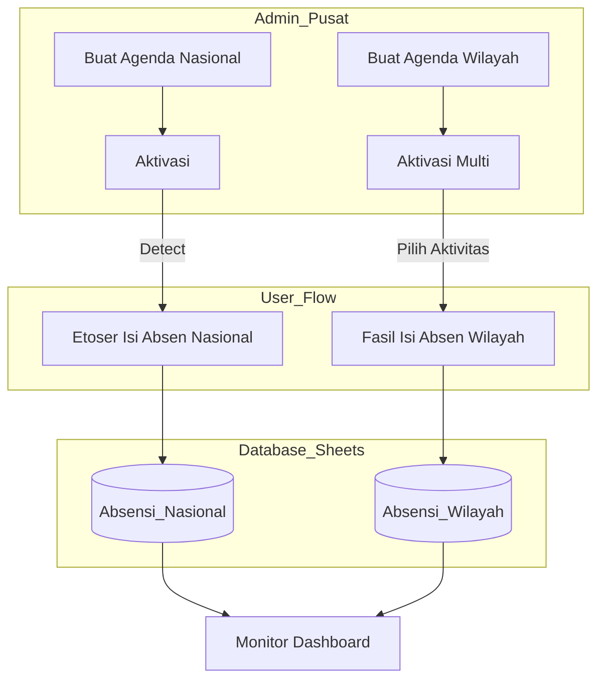

# Alur Sistem Absensi Etos ID (Nasional & Wilayah)

Berikut adalah panduan ringkas mengenai cara kerja sistem absensi yang telah kita bangun, dipisahkan berdasarkan peran pengguna.

## 1. POV Etoser (Absensi Nasional)
Digunakan saat ada agenda besar yang diikuti seluruh Etoser se-Indonesia.

- **Akses**: Membuka `/absen-pembinaan`.
- **Proses**: 
    1. Sistem menampilkan **Agenda Nasional** yang sedang diaktifkan oleh Admin Pusat (otomatis muncul Nama & Tema).
    2. Etoser memasukkan **ID Etoser** (dan data pendukung jika form meminta).
    3. Etoser klik "Hadir".
- **Output**: Data tersimpan di sheet `Absensi_Nasional`.

---

## 2. POV Fasilitator (Absensi Wilayah)
Digunakan untuk kegiatan rutin di wilayah (Tahsin, Kajian Wilayah, Bedah Buku, dsb).

- **Akses**: Membuka `/absen-wilayah`.
- **Proses**:
    1. Fasilitator melihat daftar **Aktivitas Wilayah** yang sedang aktif (misal: Tahsin & Bedah Buku).
    2. Fasilitator memilih salah satu jenis aktivitas.
    3. Fasilitator memasukkan **ID Fasilitator** dan **Tanggal Pelaksanaan** (tanggal kegiatan sebenarnya di wilayah).
    4. Fasilitator memasukkan **ID Etoser** satu per satu (atau kolektif) yang hadir di kegiatan tersebut.
    5. Klik "Simpan Absensi".
- **Output**: Data tersimpan di sheet `Absensi_Wilayah` lengkap dengan info tanggal & fasilitator yang menginput.

---

## 3. POV Admin Pusat (Monitoring & Kontrol)
Memegang kendali penuh atas apa yang bisa diisi oleh Etoser & Fasilitator.

- **Akses**: Dashboard Admin (`/admin/dashboard`).
- **Manajemen Agenda**:
    - **Nasional**: Membuat agenda dengan tanggal tetap. Hanya **1 agenda** yang bisa aktif dalam satu waktu (saling menggantikan).
    - **Wilayah**: Membuat "Template" aktivitas (misal: "Kajian Islam"). **Banyak agenda** bisa aktif bersamaan untuk memberikan pilihan bagi Fasilitator.
- **Monitoring**:
    - Melihat rekap kehadiran secara *real-time*.
    - Pada absensi wilayah, Admin bisa melihat **siapa Fasilitatornya** dan **kapan tanggal asli** kegiatan tersebut dilakukan di wilayah masing-masing (bukan hanya waktu input saja).

---

## Ringkasan Alur Data (Mermaid)

> [!TIP]
> **Poin Penting**: Agenda Wilayah bersifat statis (sebagai pilihan menu), sedangkan tanggal aktualnya ditentukan secara dinamis oleh Fasilitator saat mengisi form. Ini mempermudah admin pusat karena tidak perlu membuat agenda baru setiap minggu untuk kegiatan rutin wilayah.
